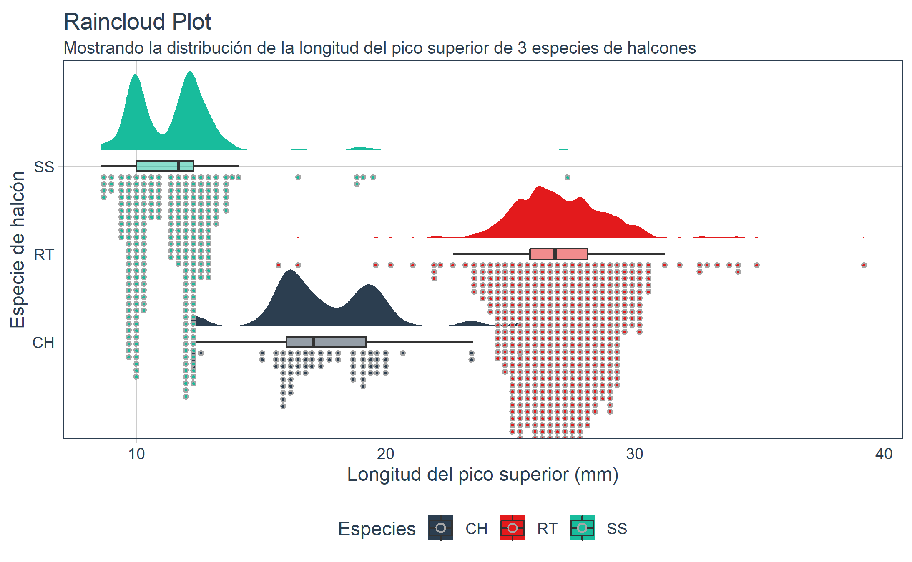

# A5: Estudio de técnicas de visualización de datos (PEC2)

**Autor**: Ouassim Aouattah Akandouch

**Asignatura**: Visualización de Datos. Máster en Ciencia de Datos, UOC.

**Fecha**: Noviembre 2022

## Pie Chart
https://public.flourish.studio/visualisation/12007575/

*Pie Chart* es un tipo de gráfico circular que muestra la proporción de una variable en relación a otras mediante un círculo dividido en porciones. Describe datos cualitativos.

El primer gráfico circular que se conozca se acredita a *Breviario estadístico* de **William Playfair**, año 1801, en el que mostraba la proporción del imperio turco en las regiones de Asia, Europa y África.

En este caso, se ha utilizado para mostrar la proporción de votos de los diferentes *partidos polítcos* en tres elecciones municipales de Barcelona.

## Proportional Symbol Map
https://public.flourish.studio/visualisation/12009330/

*Proportional Symbol Map* es un tipo de mapa temático que utiliza símbolos para representar la magnitud de una variable. Describe datos cuantitativos.

El primer mapa de este tipo se acredita a **Henry Drury Harness**, cuyo mapa del tráfico de carga en Irlanda (año 1838) mostraba la población de las ciudades con círculos de tamaño proporcional. 

En este caso, se ha utilizado para comparar el PIB de las diferentes comunidades autónomas de España en 2020.

## Raincloud Plot

*Raincloud Plot* es un tipo de gráfico de caja y bigotes, pero con la particularidad de que los datos se muestran como puntos en lugar de cajas. Además, se añade una nube de puntos que muestra la densidad de los datos. Este tipo de gráfico es muy útil para comparar dos o más grupos de datos.

Se presentó por primera vez en el paper *Raincloud Plots: A multi-platform tool for robust data visualization* de **Micah Allen**, año 2019. Describe datos cuantitativos.

En este caso, se ha utilizado para comparar la distribución de los datos de la variable *Longitud del pico* en tres especies de halcones: *Halcón de Cooper*, *Ratonero de cola roja* y *Gavilán americano*. Se ha utilizado la librería *ggdist* de R.

Source: Dataset 'Hawks' de la librería Stat2Data.
